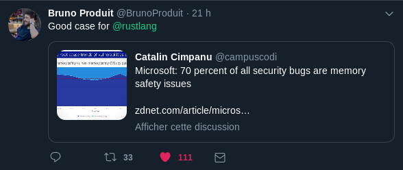
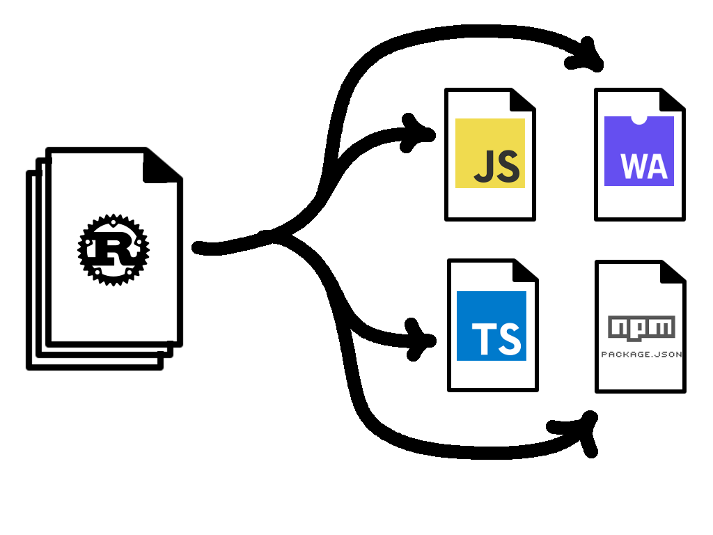

name: none
layout: true

---

name: inverse
layout: true
class: left, middle, inverse


---

name: normal
layout: true
class: left, middle


---

class: middle, center

# Rust and Wasm 🕸

#### William Mbotta
#### [@sepiropht](https://twitter.com/elimbi_william) | [@github](https://github.com/sepiropht)


???

* Je vais presenter wasm, et plus précisement wasm-binden
*

---


class: center

## wasm-bindgen

### Facilite une interaction de haut niveau entre les modules wasm et les modules javascripts
---
class: center
## wasm-bindgen

### Facilite une interaction de haut niveau les modules wasm  et les modules javascripts
# Quoi ?
---
class: center
## wasm-bindgen
### Facilite une interaction de haut niveau  entre les modules wasm  et les modules javascripts
# Quoi ?
# Pourquoi ?
---
class: center
## wasm-bindgen
### Facilite une interaction de haut niveau  entre les modules wasm  et les modules javascripts
# Quoi ?
# Pourquoi ?
# Comment ?
---
class: center
### `wasm-bindgen` génère des bindings javascript pour permettere au javascript et wasm de communiquer
???
 Le module wasm est wrappé dans un module généré par `wasm-bindgen` avant d' être appelé par notre code javascript
---
class: center
# Pourquoi
### a t' on besoin de `wasm-bindgen` ?
---
class: center

# WebAssembly
---
### 1. format d'instruction binaire
### 2. language cible pour des languages de hauts niveaux comme C/C++/Rust

---
# Pourquoi `wasm` ?
<br>
### . poids fichiers faibles, chargement rapides
### . vitesse d'éxécution proche du natif
### . standart ouvert soutenu par tous les géants du web
---
class: center
# Pourquoi `rust` ?
---
class: center

---

### . Ownership et borrowing rendent firt-class les fuites de mémoires.
### . pas de garbage-collector et de runtime
### . cargo, sa ressemblance avec npm et son intégration avec le workflow du web
---
class: center

## Les modules Wasm ne peuvent importer ou exporter que des functions manipulant des `i32`, `i64`, `f32` et `f64`
---
class: center
## `wasm-bindgen` comme Babel
---
class: center

---

class: center

---

class: center

---
class: center
# Comment
---
class: center

# Do <u>NOT</u> Rewrite &mdash; Integrate
<br/>


???

* Corollary:
  * since we are surgically replacing performance-sensitive code paths, the
    other code paths can remain the same
  * which means that Rust+Wasm is *augmenting* your JS
  * not replacing it
* furthermore, you should be able to leverage rust-generated wasm packages from
  npm transparently
  * nothing in your workflow changes
  * you just get faster dependencies

---

class: js-code

.filename[index.js]

```js
import { greet } from "./pkg/greet";

greet();
```

???

* what is "hello world" of integrating with JS?
  * importing a function with ES modules!
* Rust-generated wasm is consumable as an ES module
* just looking at this, we can't tell if the module is JS or wasm
  * this is the level of transparent, it-just-works integration we aim for

---

class: rust-code

.filename[src/greet.rs]

```rust
use wasm_bindgen::prelude::*;

#[wasm_bindgen]
extern {
    fn alert(s: &str);
}

#[wasm_bindgen]
pub fn greet() {
    alert("Hello, World!");
}
```

???

* Here is how we implement that JS interface with Rust and Wasm
* if you don't know any Rust, don't worry we'll go through this bit by bit

---

class: rust-code

.filename[src/greet.rs]

```rust
*use wasm_bindgen::prelude::*;

#[wasm_bindgen]
extern {
    fn alert(s: &str);
}

#[wasm_bindgen]
pub fn greet() {
    alert("Hello, World!");
}
```

???

* `wasm-bindgen` is the tool we use for facilitating communication between JS
  and wasm
  * more on this later in the talk
* `use` is bringing `wasm-bindgen`'s common functionality into scope

---

class: rust-code

.filename[src/greet.rs]

```rust
use wasm_bindgen::prelude::*;

*#[wasm_bindgen]
*extern {
*   fn alert(s: &str);
*}

#[wasm_bindgen]
pub fn greet() {
    alert("Hello, World!");
}
```

???

* importing the `window.alert` function
* `extern` = these functions exist, but I don't have the definition
* `#[wasm_bindgen]` on an `extern` block creates imports at the `.wasm` level

---

class: rust-code

.filename[src/greet.rs]

```rust
use wasm_bindgen::prelude::*;

#[wasm_bindgen]
extern {
    fn alert(s: &str);
}

*#[wasm_bindgen]
pub fn greet() {
    alert("Hello, World!");
}
```

???

* exporting a `greet` function
  * `#[wasm_bindgen]` on a `pub` function makes it an export in the `.wasm`
    binary

---

class: rust-code

.filename[src/greet.rs]

```rust
use wasm_bindgen::prelude::*;

#[wasm_bindgen]
extern {
    fn alert(s: &str);
}

#[wasm_bindgen]
pub fn greet() {
*   alert("Hello, World!");
}
```

???

* calling imported `alert` function like we would any normal Rust function!

---

class: center

[](./public/img/hello-world.png)

---

# `wasm-pack`
<br/>
### 👷 Building `.wasm`
### 🎁 Creating and publishing NPM packages
###  Testing in headless browsers

---

# `wasm-bindgen`
<br/>
## Wasm<sup style="font-size: 150%">💬 🗨</sup>JavaScript

???

* facilitates communication between wasm and JS
* "bindgen" = "bindings generator"
* raw wasm functions only take and return primitive number types
  * but we want to pass strings, objects, DOM nodes, etc
  * wasm-bindgen enables that, all with the zero-cost abstraction principle
    we keep revisiting
  * generates JS glue you would otherwise have to write by hand

---

class: rust-code

.filename[src/greet.rs]

```rust
use wasm_bindgen::prelude::*;

#[wasm_bindgen]
extern {
    fn alert(s: &str);
}

/// Make a greeting!
#[wasm_bindgen]
pub fn greet() {
    alert("Hello, World!");
}
```

???

* revisit "hello world" and look closer at workflow

---

class: center

# `wasm-pack build`
<br/>


???

* `wasm-pack build` generates:
  * a `.wasm` file, containing your Rust compiled to wasm
  * a JS glue file that provides nice JS APIs to your Rust code
  * a TypeScript interface definition file for type checking your JS/TS and
    getting autocompletions
  * a `package.json` for integrating with JS tooling, bundlers, publishing to
    NPM, etc...

---

class: center, middle


???

* your JS interacts with the wasm through the generated JS glue code
* the wasm interacts with DOM/HTML5/Node/etc APIs through the generated JS glue

---

class: js-code

.filename[pkg/greet.js]

```js
// ...

export function __wbg_alert_2c86be282863e459(arg0, arg1) {
    let varg0 = getStringFromWasm(arg0, arg1);
    alert(varg0);
}

// ...
```

???

* the Rust code imported `window.alert`
* so generated JS has glue for wrapping imported functions and translating their
  arguments from numbers to JS things

---

class: js-code

.filename[pkg/greet.js]

```js
// ...

export function __wbg_alert_2c86be282863e459(arg0, arg1) {
*   let varg0 = getStringFromWasm(arg0, arg1);
    alert(varg0);
}

// ...
```

???

* recall from earlier talks that strings aren't simple in wasm
* read a Rust string from wasm memory into a JS string
* arg0 = pointer to start of string
* arg1 = length of the string

---

class: js-code

.filename[pkg/greet.js]

```js
// ...

export function __wbg_alert_2c86be282863e459(arg0, arg1) {
    let varg0 = getStringFromWasm(arg0, arg1);
*   alert(varg0);
}

// ...
```

???

* then call the actual `window.alert` function

---

class: js-code

.filename[pkg/greet.js]

```js
import * as wasm from './greet_bg';

// ...

/**
 * Make a greeting!
 * @returns {void}
 */
export function greet() {
    return wasm.greet();
}
```

???

* the generated JS also wraps the raw wasm exports and provides a nice JS
  interface to them

---

class: js-code

.filename[pkg/greet.js]

```js
*import * as wasm from './greet_bg';

// ...

/**
 * Make a greeting!
 * @returns {void}
 */
export function greet() {
    return wasm.greet();
}
```

???

* this is importing the actual `.wasm` file as an ES module

---

class: js-code

.filename[pkg/greet.js]

```js
import * as wasm from './greet_bg';

// ...

/**
 * Make a greeting!
 * @returns {void}
 */
export function greet() {
*   return wasm.greet();
}
```

???

* the generated JS also wraps the raw wasm exports and provides a nice JS
  interface to them
* it converts and wraps arguments from JS into something that wasm can
  understand
  *  some combination of `i32`/`i64`/`f32`/`f64`
* we just don't have any arguments here yet, so it doesn't do anything
* what if we wanted to write our greeting into a DOM node of the user's choice?

---

class: js-code

.filename[index.js]

```js
import { greet2 } from "./pkg/greet2";

greet2(document.body);
```

???

* this version of hello world is putting its greeting into some DOM node's text
  content
* to call this version of the function, we need to pass a DOM node
* we don't have to do anything fancy to pass the DOM node to wasm, the generated
  JS takes care of that

---

class: rust-code

.filename[src/greet2.rs]

```rust
use wasm_bindgen::prelude::*;
use web_sys::Node;

#[wasm_bindgen]
pub fn greet2(node: &Node) {
   node.set_text_content(Some("Hello, World!"));
}
```

???

* no more importing common Web functions by hand
  * using `web_sys` instead

---

class: rust-code

.filename[src/greet2.rs]

```rust
use wasm_bindgen::prelude::*;
*use web_sys::Node;

#[wasm_bindgen]
*pub fn greet2(node: &Node) {
   node.set_text_content(Some("Hello, World!"));
}
```

???

* now we are taking a reference to a DOM node parameter
  * we know it is a reference because of the `&`

---

class: rust-code

.filename[src/greet2.rs]

```rust
use wasm_bindgen::prelude::*;
use web_sys::Node;

#[wasm_bindgen]
pub fn greet2(node: &Node) {
*  node.set_text_content(Some("Hello, World!"));
}
```

???

* and setting its `textContent` to "Hello, World!"

---

class: center

# `wasm-pack build`
<br/>
<video src="./public/img/excited-corgi.mp4" autoplay="" loop="" playsinline=""></video>

---

class: js-code

.filename[pkg/greet2.js]

```js
import * as wasm from './greet2_bg';

// ...

export function greet2(arg0) {
    try {
        return wasm.greet2(addBorrowedObject(arg0));
    } finally {
        stack.pop();
    }
}
```

???

* Not showing import wrappers
  * wrapping the `Node.prototype.textContent` setter is largely the same as
    wrapping `window.alert`

---

class: js-code

.filename[pkg/greet2.js]

```js
import * as wasm from './greet2_bg';

// ...

export function greet2(arg0) {
    try {
*       return wasm.greet2(addBorrowedObject(arg0));
    } finally {
*       stack.pop();
    }
}
```

???

* `addBorrowedObject` pushes an object onto the stack and returns its index
* `stack.pop()` removes it from the stack after the call is done

---

class: center
# [Demo](https://github.com/sepiropht/tic-tac-toe-wasm)


???

* we don't bite, but we do hug

---

template: inverse
class: center

# THANK YOU!
<br/>
### William Mbotta
<br/>
### [@sepiropht](https://twitter.com/elimbi_william) | [github](https://github.com/sepiropht)
